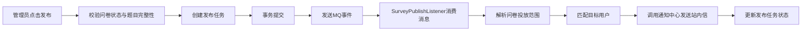
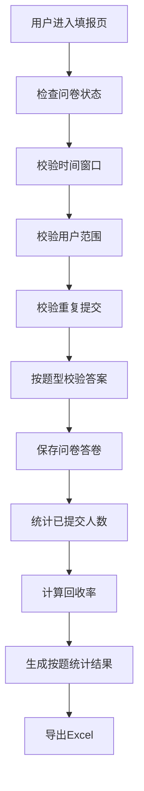
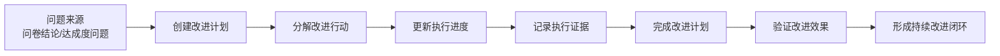
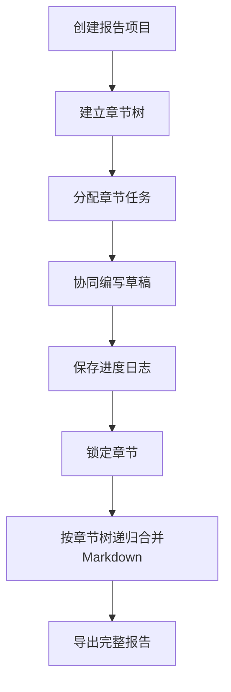

# 成员E算法与图示补充素材

本文档用于补充实习报告中“算法设计、关键代码、公式与图示”部分，范围仅针对成员 E 负责的五项功能：

- F21 问卷设计、发布与异步推送
- F22 问卷填报与回收统计
- F23 持续改进计划与改进记录
- F24 自评报告任务与协同撰写
- F25 AI 智能分析与报告辅助

文中代码块以“可放进报告正文的代表性代码”为目标，不追求贴出整类源码；图示采用 Mermaid，便于后续转成图片或重画。

---

## 1. 可重点补强的算法点

如果老师认为“算法太少”，建议优先补以下 5 个点：

1. 问卷异步发布算法
2. 问卷填报校验与回收率统计算法
3. 持续改进计划状态同步算法
4. 自评报告章节树合并算法
5. AI-RAG 检索生成与确认回写算法

这 5 个点刚好覆盖成员 E 的完整业务闭环，而且既有业务逻辑，也有公式和流程图，适合写进本科实习报告。

---

## 2. F21 问卷异步发布算法

### 2.1 算法说明

问卷发布不是简单把问卷状态改成“已发布”，而是包含以下步骤：

1. 校验问卷是否允许发布
2. 校验问卷题目是否为空
3. 创建发布任务
4. 提交事务后发送 MQ 事件
5. 消费端解析投放范围
6. 找出目标用户
7. 调用通知中心发送站内通知
8. 更新发布任务状态

其核心目的是避免大范围投放时同步发送消息造成接口阻塞。

### 2.2 代表性代码

```java
@Override
@Transactional
public SurveyQuestionnaire publish(Long id, SurveyDispatchRequest request) {
    SurveyQuestionnaire questionnaire = getRequiredQuestionnaire(id);
    validateCanPublish(questionnaire);
    return createTaskAndDispatch(
            questionnaire,
            SurveyMqConstants.TASK_ACTION_PUBLISH,
            request
    );
}
```

```java
public void handlePublishEvent(SurveyPublishEvent event) {
    PublishTask task = publishTaskService.getById(event.getTaskId());
    List<Long> userIds = resolveTargetUserIds(task.getQuestionnaireId());
    for (Long userId : userIds) {
        noticeService.send(buildNoticeRequest(task, userId));
    }
    publishTaskService.markSuccess(task.getId());
}
```

### 2.3 伪代码

```text
Algorithm PublishQuestionnaire
Input: questionnaireId, dispatchRequest
Output: publishTaskStatus

1. questionnaire <- loadQuestionnaire(questionnaireId)
2. if questionnaire does not exist then reject
3. if questionnaire has no questions then reject
4. if questionnaire status is invalid then reject
5. task <- createPublishTask(questionnaire, dispatchRequest)
6. commit transaction
7. send MQ event(task.id)
8. listener consumes event
9. users <- resolveTargetUsers(questionnaire.scope)
10. for each user in users:
       sendNotice(user, questionnaire)
11. update task as SUCCESS or FAILED
```

### 2.4 推荐图示

图名建议：`图X-X 问卷发布异步处理流程图`



### 2.5 可直接写进报告的表述

> 在问卷发布功能实现中，我没有采用同步逐个通知用户的方式，而是设计了“发布任务 + 消息队列异步消费”的处理算法。该算法先在事务中完成问卷发布任务的创建，再通过消息队列通知消费端解析投放范围并发送站内消息，从而降低了接口响应时间，提高了系统在大批量用户场景下的可用性。

---

## 3. F22 问卷填报校验与回收统计算法

### 3.1 算法说明

问卷提交时需要做多层校验：

1. 问卷必须存在
2. 问卷状态必须为 `PUBLISHED`
3. 当前时间必须位于开始时间和结束时间之间
4. 当前用户必须属于问卷投放范围
5. 同一用户不能重复提交
6. 不同题型要按各自规则校验答案合法性

### 3.2 代表性代码

```java
String availabilityError = validateFillAvailability(
        questionnaire,
        request.getRespondentUserId(),
        true
);
if (availabilityError != null) {
    throw new IllegalStateException(availabilityError);
}

Map<Long, SurveySubmitAnswerRequest> answerMap = normalizeAnswerMap(request.getAnswers());
validateSubmitAnswers(detail.getQuestions(), answerMap);
saveResponse(questionnaire, request, answerMap);
```

### 3.3 必要公式

#### 1. 回收率公式

$$
RecoveryRate = \\frac{SubmittedCount}{TargetCount} \\times 100\\%
$$

其中：

- `SubmittedCount` 表示已提交答卷人数
- `TargetCount` 表示目标投放人数

#### 2. 题目选项占比公式

$$
OptionRatio_i = \\frac{OptionSelectedCount_i}{ValidResponseCount} \\times 100\\%
$$

其中：

- `OptionSelectedCount_i` 表示第 `i` 个选项被选择的次数
- `ValidResponseCount` 表示该题有效作答总人数

#### 3. 回收人数关系式

$$
PendingCount = TargetCount - SubmittedCount
$$

### 3.4 多题型校验伪代码

```text
Algorithm ValidateSubmitAnswers
Input: questionList, answerList
Output: valid / invalid

1. for each question in questionList:
2.     answer <- find answer of current question
3.     if question is required and answer is empty:
4.         reject
5.     if question type = SINGLE and selected options != 1:
6.         reject
7.     if question type = MULTIPLE and selected options < min or > max:
8.         reject
9.     if question type = MATRIX and row-column pair is invalid:
10.        reject
11. return valid
```

### 3.5 推荐图示

图名建议：`图X-X 问卷填报与回收统计流程图`



### 3.6 可直接写进报告的表述

> 在问卷填报模块中，我设计了分层校验算法。系统首先对问卷状态、时间窗口、投放范围和重复提交进行整体判断，然后按单选、多选、文本和矩阵题的差异化规则执行答案合法性校验。答卷提交完成后，系统基于目标人数和已提交人数自动计算回收率，并对题目选项分布进行统计，从而形成“填报-回收-统计-导出”的完整数据闭环。

---

## 4. F23 持续改进计划状态同步算法

### 4.1 算法说明

持续改进模块的关键不只是“保存计划”，而是需要在行动项进度变化后自动同步计划状态。例如：

- 行动项未开始时，计划状态为 `PENDING`
- 任一行动项开始执行后，计划进入 `IN_PROGRESS`
- 所有行动项完成后，计划进入 `COMPLETED`
- 人工复核通过后，计划进入 `VERIFIED`

### 4.2 代表性代码

```java
if (request.getProgressPercent() != null) {
    validateProgress(request.getProgressPercent());
    action.setProgressPercent(request.getProgressPercent());
}

if (action.getProgressPercent() != null
        && action.getProgressPercent().compareTo(new BigDecimal("100")) >= 0
        && !ACTION_VERIFIED.equals(action.getStatus())) {
    action.setStatus(ACTION_COMPLETED);
}

improvePlanActionService.updateById(action);
syncPlanStatusFromActions(action.getPlanId(), false);
```

### 4.3 进度计算公式

如果系统未设置行动项权重，可采用等权平均进度：

$$
PlanProgress = \\frac{1}{n} \\sum_{i=1}^{n} Progress_i
$$

其中：

- `n` 为行动项数量
- `Progress_i` 为第 `i` 个行动项进度百分比

如果后续扩展权重，也可写成：

$$
PlanProgress = \\sum_{i=1}^{n} w_i \\cdot Progress_i
$$

且满足：

$$
\\sum_{i=1}^{n} w_i = 1
$$

### 4.4 状态同步伪代码

```text
Algorithm SyncPlanStatusFromActions
Input: actionList
Output: planStatus

1. if all actions are pending:
2.     planStatus <- PENDING
3. else if all actions are completed:
4.     planStatus <- COMPLETED
5. else:
6.     planStatus <- IN_PROGRESS
7. if manager verifies result:
8.     planStatus <- VERIFIED
9. return planStatus
```

### 4.5 推荐图示

图名建议：`图X-X 持续改进闭环流程图`



### 4.6 可直接写进报告的表述

> 持续改进模块中，我重点实现了“行动项进度驱动计划状态变化”的同步算法。系统在更新某一行动项进度后，会重新汇总同一计划下全部行动项的状态，从而自动判断计划处于待执行、执行中还是已完成阶段，并在人工复核后进一步进入已验证状态。这一设计使持续改进过程具备可跟踪、可量化和可闭环的特点。

---

## 5. F24 自评报告章节树合并算法

### 5.1 算法说明

自评报告不是简单的单文档编辑，而是章节树结构下的协同撰写。导出完整报告时，需要：

1. 读取报告项目
2. 读取章节树
3. 按父子层级递归遍历章节
4. 依次拼接 Markdown 标题与正文
5. 输出完整合并文档

### 5.2 代表性代码

```java
StringBuilder builder = new StringBuilder();
builder.append("# ").append(project.getProjectName()).append(System.lineSeparator()).append(System.lineSeparator());
builder.append("- Report Code: ").append(project.getReportCode()).append(System.lineSeparator());
builder.append("- Academic Year: ").append(project.getAcademicYear()).append(System.lineSeparator());
builder.append("- Generation Mode: ").append(project.getGenerationMode()).append(System.lineSeparator()).append(System.lineSeparator());
appendChapterMarkdown(builder, childrenMap, 0L, 2);
return builder.toString();
```

### 5.3 递归合并伪代码

```text
Algorithm AppendChapterMarkdown
Input: parentId, chapterTree, level
Output: mergedMarkdown

1. children <- getChildren(parentId)
2. for each child in children:
3.     append heading(level, child.title)
4.     append child.content
5.     AppendChapterMarkdown(child.id, chapterTree, level + 1)
```

### 5.4 标题层级映射关系

当根章节标题从二级标题开始时，可表示为：

$$
HeadingLevel = BaseLevel + Depth
$$

其中：

- `BaseLevel = 2`
- `Depth` 为当前章节在树中的深度

### 5.5 推荐图示

图名建议：`图X-X 自评报告章节树合并流程图`



### 5.6 可直接写进报告的表述

> 在自评报告模块中，我实现了基于章节树的递归合并算法。系统在导出报告时，不是按数据库记录的简单顺序拼接文本，而是按照章节父子结构逐层遍历，并根据章节深度自动生成对应层级的 Markdown 标题，最终形成结构完整、顺序正确的合并报告。

---

## 6. F25 AI-RAG 检索生成与确认回写算法

### 6.1 算法说明

AI 模块不是单纯的“对话框”，而是完整的 RAG 业务闭环：

1. 读取报告章节或改进计划内容
2. 生成知识文档
3. 文本分块
4. 向量化并写入 Qdrant
5. 用户发起 AI 请求
6. 检索相关知识片段
7. 组装 Prompt
8. 调用 DeepSeek
9. 保存 AI 请求与结果
10. 用户确认后回写业务数据

### 6.2 代表性代码

```java
ReportChapter chapter = getRequiredChapter(chapterId);
String scenarioType = resolveReportScenario(request == null ? null : request.getOperationType());
String templateCode = StringUtils.hasText(request == null ? null : request.getTemplateCode())
        ? request.getTemplateCode().trim().toUpperCase(Locale.ROOT)
        : scenarioType;

AiAnalysisRequest analysisRequest = initRequest(
        scenarioType,
        "REPORT_CHAPTER",
        chapterId,
        getRequiredTemplate(templateCode).getId(),
        request.getRequesterUserId(),
        buildReportMetadata(chapter, request)
);

aiAnalysisRequestService.save(analysisRequest);
executeReportRequest(analysisRequest, chapter, request);
```

```java
List<KnowledgeChunk> chunks = retrieveReportChunks(chapter);
String prompt = renderTemplate(template, chapterContext, chunks);
String result = deepSeekClient.generate(prompt);
saveSuccessResult(requestId, result);
```

### 6.3 文本分块数量公式

设：

- `L` 表示总文本长度
- `S` 表示单块最大长度
- `O` 表示块间重叠长度

则分块数量可近似表示为：

$$
ChunkCount = \\left\\lceil \\frac{L - O}{S - O} \\right\\rceil
$$

### 6.4 向量检索相似度公式

当使用余弦相似度检索时：

$$
Similarity(\\vec{q}, \\vec{d}) =
\\frac{\\vec{q} \\cdot \\vec{d}}
{\\|\\vec{q}\\| \\cdot \\|\\vec{d}\\|}
$$

其中：

- `\\vec{q}` 表示查询向量
- `\\vec{d}` 表示知识片段向量

相似度越高，说明该知识片段与当前请求越相关。

### 6.5 AI 回写伪代码

```text
Algorithm GenerateAndConfirmAIResult
Input: sourceObject, template
Output: confirmedBusinessData

1. context <- buildBusinessContext(sourceObject)
2. chunks <- retrieveRelevantChunks(context)
3. prompt <- renderPrompt(template, context, chunks)
4. result <- callLLM(prompt)
5. save AI request and AI result
6. wait for user confirmation
7. if user confirms:
8.     write result back to report draft or improve plan
9.     mark request as CONFIRMED
```

### 6.6 推荐图示

图名建议：`图X-X AI-RAG 检索生成与确认回写流程图`

```mermaid
flowchart LR
    A[报告章节/改进计划原始内容] --> B[生成知识文档]
    B --> C[文本分块]
    C --> D[向量生成]
    D --> E[写入Qdrant]
    E --> F[用户发起AI请求]
    F --> G[构造业务上下文]
    G --> H[检索相关Chunk]
    H --> I[组装Prompt]
    I --> J[调用DeepSeek生成结果]
    J --> K[保存AI请求与结果]
    K --> L[用户确认]
    L --> M[回写报告草稿或改进计划]
```



### 6.7 可直接写进报告的表述

> 在 AI 智能分析与报告辅助模块中，我实现了基于 RAG 的业务闭环算法。系统先将报告章节或改进计划内容转换为知识文档，经过分块和向量化后写入 Qdrant；在用户发起请求时，再根据业务上下文检索相关知识片段，动态组装提示词并调用大模型生成结果。生成完成后，用户可以人工确认，并将结果正式回写到报告草稿或改进计划中，从而形成“知识准备-智能生成-确认回写”的完整链路。

---

## 7. 最适合放进报告的图

如果只打算放 4 张图，建议优先选这 4 张：

1. 问卷发布异步处理流程图
2. 问卷填报与回收统计流程图
3. 持续改进闭环流程图
4. AI-RAG 检索生成与确认回写流程图

如果可以放 5 张图，则再加：

5. 自评报告章节树合并流程图

---

## 8. 最适合放进报告的公式

建议优先放以下 4 个公式：

1. 回收率公式
2. 选项占比公式
3. 计划总进度公式
4. 向量检索余弦相似度公式

这样既覆盖了传统业务统计，也覆盖了 AI 检索算法，内容不会显得过于单薄。

---

## 9. 可直接作为小节标题使用

以下标题可直接放进报告正文：

- 4.X 问卷异步发布算法设计
- 4.X 问卷填报校验与回收统计方法
- 4.X 持续改进计划状态同步机制
- 4.X 自评报告章节树递归合并算法
- 4.X 基于 RAG 的 AI 报告辅助算法

---

## 10. 写作建议

写报告时，不要把这些内容写成“高深理论算法”，而要写成“面向业务问题的实现方法”。更合适的表达方式是：

- 为了解决批量通知阻塞问题，设计了异步发布算法
- 为了保证问卷回收结果准确性，设计了多层校验与统计方法
- 为了体现持续改进闭环，设计了计划状态同步机制
- 为了支持章节协同导出，设计了章节树递归合并算法
- 为了增强 AI 生成结果的相关性，设计了基于向量检索的 RAG 流程

这样更符合本科实习报告的写法，也更贴近你在项目中的真实工作。
